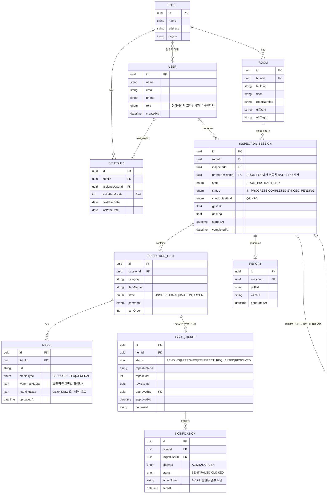

# ERD (초안) — BATH PRO / ROOM PRO

> 상태: **Draft** — 개발 진행하며 계속 수정 예정. 확정본 아님.
> 근거: `BUILD_PLAN.md` 2장 데이터 모델 초안 + SRS v2.0

## 다이어그램

## 확정이 필요한 부분 (TODO)

- [ ] `INSPECTION_ITEM`의 category/itemName을 코드 테이블(마스터 데이터)로 뺄지, 문자열로 둘지 결정 — ROOM PRO 15개 구역 / BATH PRO 12개 구역이 고정이라면 마스터 테이블 권장
- [ ] `IssueTicket`이 `InspectionItem` 1:1인지, 여러 항목을 묶어 하나의 티켓으로 만들 수도 있는지 (SRS엔 항목 단위로 보임)
- [ ] `User`-`Hotel` 다대다 매핑 테이블(`UserHotelMapping`) 컬럼: 역할별로 매핑 의미가 다를 수 있음 (호텔담당자는 1:N, 현장점검자는 스케줄 기반 배정)
- [ ] 오프라인 동기화 충돌 시 `InspectionSession`/`InspectionItem`에 버전/updatedAt 기반 충돌 해소 컬럼 필요 여부
- [ ] Soft delete 여부 (deletedAt) — 점검 이력은 감사 목적상 삭제보다 상태 변경으로 처리 권장
